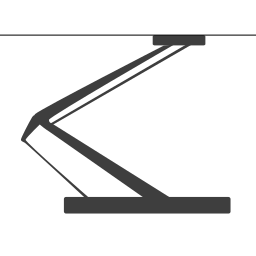

# Pantograph

A Machine-to-Machine interaction system for Lean 4.



Pantograph provides interfaces to execute proofs, construct expressions, and
examine the symbol list of a Lean project for machine learning.

See [documentations](doc/rationale.md) for design rationale and references.

## Installation

For Nix users, run
``` sh
nix build .#{sharedLib,executable}
```
to build either the shared library or executable.

For non-Nix users, install `lake` and `lean` fixed to the version of the
`lean-toolchain` file, and run

``` sh
lake build
```
This builds the executable in `.lake/build/bin/repl`.

### Executable Usage

The default build target is a Read-Eval-Print-Loop (REPL). See [REPL
Documentation](./doc/repl.md)

Another executable is the `tomograph`, which processes a Lean file and displays
syntax or elaboration level data.

### Library Usage

`Pantograph/Library.lean` exposes a series of interfaces which allow FFI call
with `Pantograph` which mirrors the REPL commands above. Note that there isn't a
1-1 correspondence between executable (REPL) commands and library functions.

Inject any project path via the `pantograph_init_search` function.

## Development

A Lean development shell is provided in the Nix flake. Nix usage is optional.

### Testing

The tests are based on `LSpec`. To run tests, use either
``` sh
nix flake check
```
or
``` sh
lake test
```
You can run an individual test by specifying a prefix

``` sh
lake test -- "Tactic/No Confuse"
```
